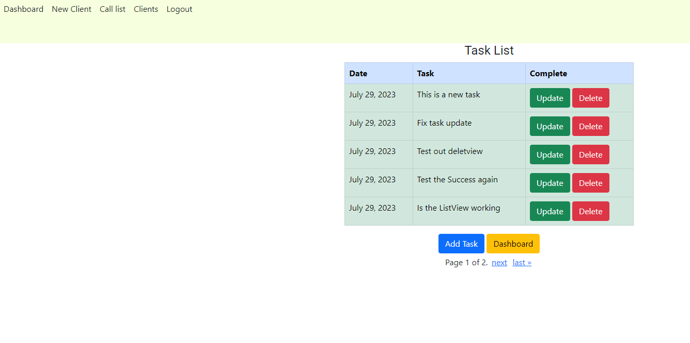
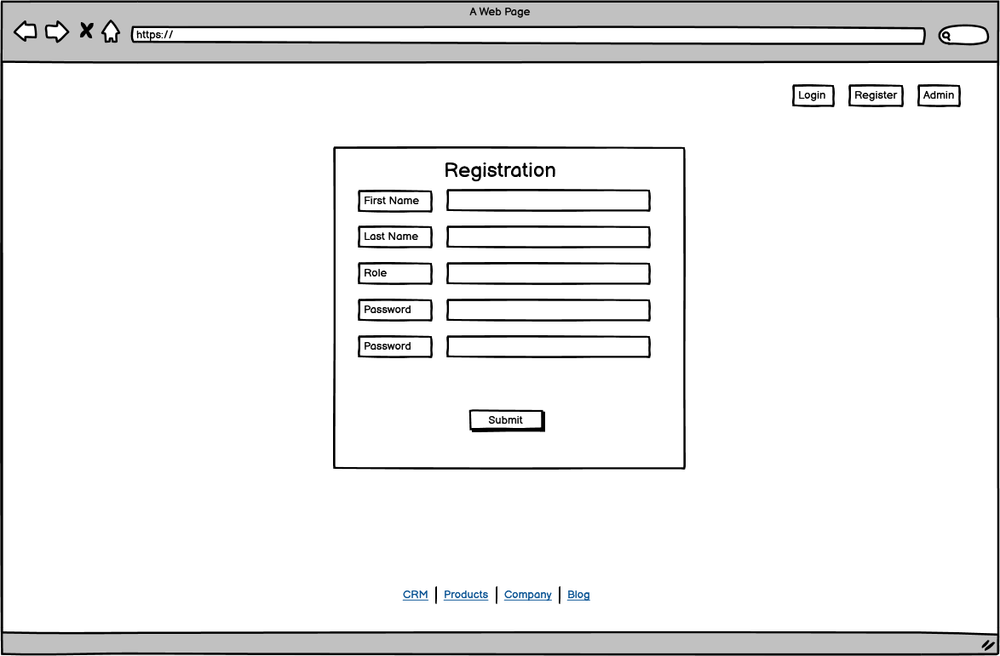
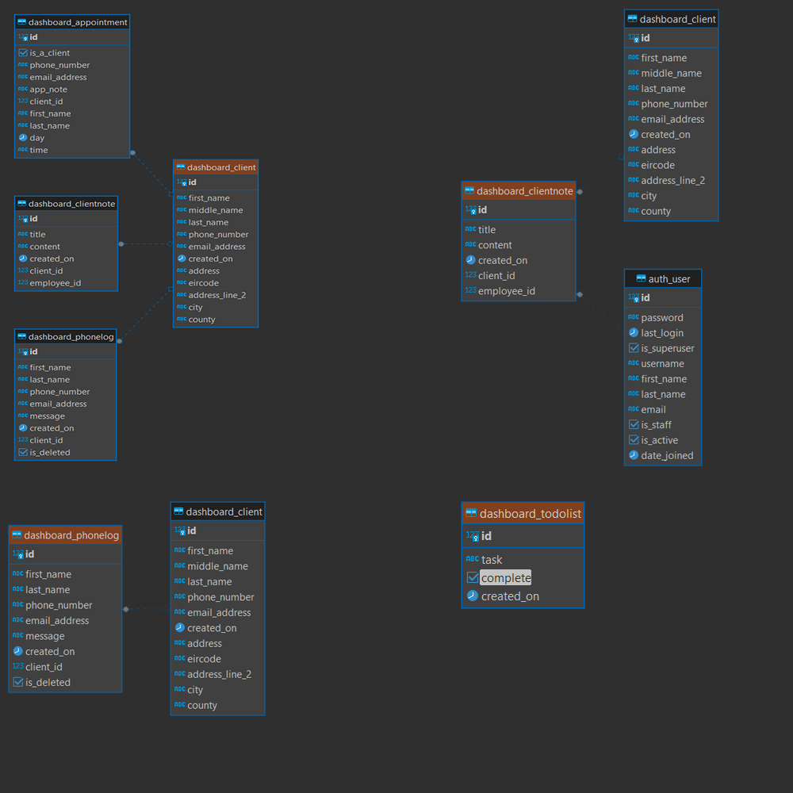

## CRM Django App - Clientflow
This is a client management system for a small business. This Django app is intended for use in an office environment on standard-size screens only and does not support mobile devices. At the heart of the CRM system is the ability to create detailed client profiles. You can record information on each client, including the client's name, address, phone number, and email. Users can update the client record with new information. The user can attach notes to client profiles. Users can edit, update, or delete these notes, allowing for tracking of client interactions and important details. Users can log calls from clients and create tasks.

### Features

User Registration and Authentication

Django-Allauth handles user login, registration, and account management. I used this method to manage registration and authentication for its ease of integration, flexibility, and support for social authentication. In this type of application, the social authentication system is not used, and user access control is completed through the admin panel, which is limited to a superuser.

Django-Allauth provides a full suite of account management features, including password reset, account email management, and more

I use the following:
- User registration form with fields username, email, and password.
- User login and logout functionality.

Login: 
Signup: 

Customer Management

Create a new client with details such as name, email, phone number, and address. View a list of all clients. Search for a client. Edit client details (name, email, phone number, and address).

Create client: 

client list: 

Client details: 

Call Logging

Log callsfrom to clients. Record information like date, time, and notes. Access call log from dashboard. You can associcate a call with the client as the databases are connected but it has not been implemented at the moment.

Log calls: 
Call log : 

To-Do List

Allow users to create a to-do list for managing tasks.

Task : 

Notes Management

Allow users to add notes to customer files. Edit notes. Associate notes with the respective client. Display the notes in chronological order with timestamps.

Notes : 
Notes edit : 

## Design
I initially laid out this app in Balsamiq. My design unfortunately came up against the reality of my current abilities when it came to implementation. However, I will continue to work towards design in the future.

Landing page

A simple landing page with a logo and login or register buttons

Landing page : 

Registration Page

A registration page that reqires users details, role and password.

Registration page: 

Login

A login page that requires a username and password.

login page : 

Dashboard

The dashboard is the central hub. The user will be on this page for the majority of the time and will be able to navigate to different features from the dashboard.

Dashboard : 

Client file

All the client details, notes, and associated files will be displayed here.

clients file : 

Call Log 

The call log records and links the details of the call to the client database. I had originally wanted the call log to be modal, but I found that it was not straight forward to add this in Django. In the end, I did not implement this.

Call log : 

Appointments and Calander

I had wanted to add a calendar and appointment system to my client management system, but this turned out to be beyond my abilities and the scope of the project. But this is something I will be working on in the future.

Calendar : 
Appointments : 

## Testing 
I have manually navigated through different pages and functionalities. I have verified that all elements (buttons, forms, and links) are functioning as expected, and the user interface is rendering correctly.

## Manual Testing
### Registration 

| Objective | Test | Expected result | Passed |
| :---:     | :---:|    :---:        | :---:  |
| Check if registration works | Click on register link, complete the form and click on the signup button. | Redirects to the homepage with dashboard link | Passed |
| Check if login works | Click on login link, complete the form and click login | Redirects to the homepage with dashboard link | Passed |
| Check if Logout works | Click on logout link, click on confirmation | Redirect to homepage with rgister and login links | Passed |

### Dashboard Functionality 

| Objective | Test | Expected result | Passed |
| :---:     | :---:|    :---:        | :---:  |
| Verify that the Log Call feature correctly records a call with details. | Click on "LOG CALL" button, fill in the call details in the form, submit the form | The call is recorded in the database, and the call log is updated with the new entry. | Passed |
| Confirm delete buttton works in display call | Click the delete button | The call is removed from the database | Passed |
| Ensure that the Add Task feature allows users to add tasks to their to-do list | Click on "ADD TASK" button, Enter task details in the form, Submit the form | The task is added to the user's to-do list and is visible in the Task List. | Passed |
| Confirm Delete buttton works- Task | Click the delete button | The task is removed from the database | Passed |
| Confirm that the New Client feature works and the new client is added to the database | Click on "ADD CLIENT" button. Complete the form with clients details. Submit the form |  The new client information is stored in the database and can be retrieved when searched for. | Passed |
| Test the search functionality to locate existing clients. | Use the search bar. Enter the name of an existing client. Click on the "Search" button | The application returns a list of clients that match the search query | Passed |
| Confirm Delete buttton works - clients | Click the delete button | The client is removed from the database | Passed |
### Clients file

| Objective | Test | Expected result | Passed |
| :---:     | :---:|    :---:        | :---:  |
| Verify that the client details can be updates | Click on "UPDATE" button, fill in the NEW details in the form, Submit the form | The update details is recorded in the database. | Passed |
| Add note to clients file | Click on "ADD NOTE" button, fill in the details in the form, Submit the form | The note is added to the client file | Passed |
| Edit note on client file | Click on "VIEW NOTE" button, click on "EDIT NOTE" button, update note with new details, submit the form | The note is has the updated information | Passed |
| Confirm Delete buttton works - client's note | Click the delete button | The note is removed from the database | Passed |

### Other Test
| Objective | Test | Expected result | Passed |
| :---:     | :---:|    :---:        | :---:  |
| Verify that all forms have proper validation and do not accept invalid input. | Try to submit forms with invalid or incomplete data. Check for mandatory fields and input formats. | The form will not submit and provide error feedback | Passed |
|  Ensure that all navigation links and buttons work correctly. | Click on each menu item and button to navigate to different sections. Check that the URL matches the expected destination. | Each navigation element leads to the correct section without errors. | Passed |

## Validator Testing

## Pep8 Valdator
### Results
[CI Python Linter](https://pep8ci.herokuapp.com/) was used to validate the Pyton code.

#### Dashboard

Admin.py

Admin.py No errors: 

Forms.py

Forms.py No errors : 

Models.py

Models.py No errors: 

Urls.py

Urls.py No errors: 

#### pp4_crm_app

Settings.py

Settings.py : 

Urls.py

Urls.py : 

## LightHouse 
Lighthouse is a Google Dev tool to check performance and accessibility. My font colour failed the accessibility test, as the blue font failed the contrast test against the light green background. I changed the text font from blue to black to improve my accessibility score. The black font passed the test.

Accessibility

Accessibility : 

The perfomance test passed.

Performace

Performace : 

## W3C Validation
No errors or warnings. I could not find the trailing slash discussed in the INFO meassage. It does not impact the site.
### HTML

Index

Index : 

Dashboard

Dashboard : 

New Client

New Client : 

Client list

Client list : 

Display call

Display call : 

Task

Task : 

Task-list

Task-list : 

### CSS
No errors found

Dashboard

Dashboard : 

Task

Task : 

Call log

 Call log: 

## Databases
The client management system uses a database schema in production hosted on ElephantSQL, a PostgreSQL server. The schema comprises tables like 'dashboard_appointments', 'dashboard_client', dashboard_cleintnote', and 'dashboard_phonelog', each with fields to capture client interactions, notes, and appointments. However, in the finished version of the project, I have only implemented a link between a client and a client note. In the future, I plan to add appointments, link call logs with clients, and add calendars to track deadlines.

Database

Database : 

## Deployment
I would recommend deploying your app at the begining of the project.
This project was deployed to Heroku, install the following programs to the Django project. 
- Gunicorn  - pip3 install django gunicorn
- Pyscopg2 - pip3 install dj_database_url pysopg2
- Cloudainary - pip3 install dj3-Cloudainary-Storage
- Create an env.py file in the root directory of the project.\

### Gunicorn
When deploying a Django application to Heroku, Gunicorn serves as the WSGI HTTP server that interfaces between your Django application and the web.

### Pyscopg2
Pyscopg2 is used for connecting Python applications to a PostgreSQL database. In my case ElephantSQL

### Cloudinary 
Cloudainary is the server that manages the images in the project.

Include the above in the requirements.txt file. 

Once you have installed the above programs you will need to update your settings.py with code below.

In settings.py add **import os** and **import dj_database_url** to the top of the file. 

    import os
    import dj_database_url
    
Under the imports add the following:

    if os.path.isfile('env.py'): 
        import env 

Replace the SECRET_KEY with the following:

    SECRET_KEY = os.environ.get('SECRET_KEY')

In the database section of the settings.py file replace DATABASE default:

     'ENGINE': 'django.db.backends.sqlite3',
        'NAME': BASE_DIR / 'db.sqlite3'

With the following:

    DATABASES = {
        'default': dj_database_url.parse(os.environ.get("DATABASE_URL"))
    }

Add env.py to the gitignore.py.  Save and migrate all the changes.

In the root directory add the following folders: 
- media
- static
- templates

These files will hold you HTML templates, CSS , JS and images.

### Cloudinary
I created an account on using by linking my Github account.
Once you have an account you will have to connect cloudinary to the project.

From the Cloudinary dashboard copy the CLOUDINARY_URL  from the API environment variable and add Cloudinary URL to env.py file.

    os.environ["CLOUDINARY_URL"] = "cloudinary://************************"

In settings.py add the cloudinary liberies to the installed apps section as follows:

    'cloudinary_storage',
    'django.contrib.staticfiles',
    'cloudinary',
    
Note the order as it is important.

Tell Django to use cloudinary to store media file add the following below:

    STATIC_URL = '/static/'
    STATICFILES_STORAGE = 'cloudinary_storage.storage.StaticHashedCloudinaryStorage'
    STATICFILES_DIRS = [os.path.join(BASE_DIR, 'static'), ]
    STATIC_ROOT = os.path.join(BASE_DIR, 'staticfiles')

    MEDIA_URL = '/media/'
    DEFAULT_FILE_STORAGE = 'cloudinary_storage.storage.MediaCloudinaryStorage'

### ElephantSQL
I used ElephantSQL in production. Create an account, and once the account has been created, click Create New Instance. Name the plan and select the Tiny Turtle plan. This is a free plan. Select region, by selecting a datacentre near you. My datacentre is EU-West-1 (Ireland). Click review. Once the details are correct click create plan.

On the ElephantSQL dashboard click on the database and copy the ElephantSQL database URL. Paste the URL in the env.py file. 

    os.environ['DATABASE_URL'] = 'elephantsql database url'

You will also have to **import os** at the top of the env.py file.

    import os

In the env.py file you should include your secret key:

     os.environ['SECRET_KEY'] = "randomSecretKey"

### Heroku
Create a new Heroku app with a using your project name. In the config vars section of my app, and added the Cloudinary and ElephantSQL settings, along with the SECRET_KEY.  Add DISABLE_COLLECTSTATIC and 1 to the config var section.

Config vars: 

To link the django template files to the Heroku app, in settings.py file add:

    TEMPLATES_DIR = os.path.join(BASE_DIR, 'templates')
    
And change the template directory to

    TEMPLATES = [
        {
            …,
            'DIRS': [TEMPLATES_DIR],
        …,
                ],
            },
        },
    ]

In settiings.py Add the Heroku host name to the ALLOWED_HOST:

    ALLOWED_HOSTS = ["PROJ_NAME.herokuapp.com", "YOUR_HOSTNAME"]

In the root directory of the project add a **Profile**, in the **Profile** add:

    web: gunicorn ADD_YOUR_PROJECT_NAME.wsgi

Finally, I connected Github to my Heroku app. Open the deploy tab in Heroku and select github as the deployment method. You may have to login to your GitHub account if this is the first time. Select the project from the GitHub list. Select automatic deployment from the main branch. I set to atomatically deploy after each push. After the build is complete, you can open the app.

## Tools and Libraries
- Python
- Django
- CSS
- HTML
- Bootstrap 4.6
- Cloudinary
- ElephantSQL
- Heroku
- Django-allauth
- Crispy forms
- Github
- Fontawesome
- Google fonts
- Balsamiq

## Agile

## Credit

Thank you to Diasy Mcgirr for her guidance.

The following is list of resources I referred to.

model fields
<https://docs.djangoproject.com/en/4.2/ref/models/fields/#textfield>

unique id- how to create a unique id for each client
<https://stackoverflow.com/questions/16925129/generate-unique-id-in-django-from-a-model-field>

autocomplete
<https://django-autocomplete-light.readthedocs.io/en/master/index.html>
Sharing data bewteen models tables
<https://stackoverflow.com/questions/58611631/django-how-i-can-populate-data-in-a-model-from-another-table-model-in-the-same>

testing
<https://docs.djangoproject.com/en/4.2/topics/testing/overview/>
<https://docs.djangoproject.com/en/4.2/intro/tutorial05/>
<https://realpython.com/testing-in-django-part-1-best-practices-and-examples/>

Function versus genric class views
code instititude
<https://docs.djangoproject.com/en/3.2/topics/class-based-views/generic-display/>
<https://stackoverflow.com/questions/66411588/django-transforming-function-based-view-into-class-based-view>

Displaying data
<https://docs.djangoproject.com/en/4.2/ref/class-based-views/generic-display/>

Djang CRM examples
<https://github.com/MicroPyramid/Django-CRM/blob/master/leads/models.py>

<https://stackoverflow.com/questions/72671197/how-to-make-a-select-field-using-django-model-forms-using-set-values>

get_object 404
<https://docs.djangoproject.com/en/4.2/topics/http/shortcuts/>

phone number
<https://stackoverflow.com/questions/19130942/whats-the-best-way-to-store-a-phone-number-in-django-models>

AttributeError: 'function' object has no attribute 'as_view'
<https://stackoverflow.com/questions/34217400/function-object-has-no-attribute-as-view>

search table / data
<https://stackoverflow.com/questions/66386490/making-search-bar-in-django>
<https://django-filter.readthedocs.io/en/stable/>

making queries
<https://docs.djangoproject.com/en/4.2/topics/db/queries/>

listing data alphabetically
<https://stackoverflow.com/questions/16778819/django-how-to-sort-objects-alphabetically-by-first-letter-of-name-field>

client urls
<https://docs.djangoproject.com/en/4.1/ref/urlresolvers/>
<https://docs.djangoproject.com/en/3.2/topics/http/urls/#how-django-processes-a-request>

migration and edit fields
<https://stackoverflow.com/questions/70970039/django-rename-field-and-create-new-one-with-the-same-name-returns-psycopg2-error>
<https://www.w3schools.com/django/django_update_data.php>
<https://docs.djangoproject.com/en/4.2/ref/migration-operations/>

Check if user is authenticated
<https://docs.djangoproject.com/en/4.2/topics/auth/default/>
<https://docs.djangoproject.com/en/4.2/ref/utils/>
<https://stackoverflow.com/questions/29673549/method-decorator-with-login-required-and-permission-required>
<https://docs.djangoproject.com/en/4.2/topics/class-based-views/intro/>

context -- fix error code line to long.
<https://docs.djangoproject.com/en/dev/ref/templates/api/#module-django.template>

redirect after submit button is pressed
<https://stackoverflow.com/questions/60952187/how-to-redirect-to-another-page-that-contains-id-in-django>
<https://docs.djangoproject.com/en/4.2/topics/http/shortcuts/>

edit model
<https://www.youtube.com/watch?v=jCM-m_3Ysqk>
<https://docs.djangoproject.com/en/4.2/topics/forms/modelforms/>

<https://docs.djangoproject.com/en/4.2/topics/http/views/#:~:text=A%20view%20function%2C%20or%20view>,.%20.%20or%20anything%2C%20really.

debugging
<https://www.mattlayman.com/understand-django/debugging-tips-techniques/>

listing on date order
<https://stackoverflow.com/questions/9834038/django-order-by-query-set-ascending-and-descending>

edit task mark complete
<https://stackoverflow.com/questions/68113852/how-to-check-whether-the-checkbox-is-checked-in-django>

update view
<https://docs.djangoproject.com/en/4.2/ref/class-based-views/generic-editing/>

delete view
<https://docs.djangoproject.com/en/4.2/ref/class-based-views/generic-editing/>

add to user
<https://stackoverflow.com/questions/63255598/django-how-to-link-to-specific-user>
noreverse
<https://docs.djangoproject.com/en/4.2/ref/class-based-views/generic-editing/>

<https://stackoverflow.com/questions/38390177/what-is-a-noreversematch-error-and-how-do-i-fix-it>

calander
<https://stackoverflow.com/questions/75945489/django-python-calendar-module>
<https://jqueryui.com/datepicker/>
<https://stackoverflow.com/questions/18106454/how-to-use-a-jquery-datepicker-with-the-django-template-language>

Template
<https://docs.djangoproject.com/en/4.2/ref/templates/language/>

SVG

<https://www.svgbackgrounds.com/>

Modal
<https://stackoverflow.com/questions/23648761/how-to-build-django-ajax-modal-popup-forms-with-server-side-forms>
<https://jquerymodal.com/>
<https://django-bstrap-modals.readthedocs.io/en/latest/index.html>

Styling forms
<https://medium.com/swlh/how-to-style-your-django-forms-7e8463aae4fa>

Cripsy forms
<https://github.com/django-crispy-forms/crispy-bootstrap5>
<https://ordinarycoders.com/blog/article/render-a-django-form-with-bootstrap>
<https://stackoverflow.com/questions/13098954/use-crispy-form-with-modelform>
<https://django-crispy-forms.readthedocs.io/en/latest/index.html>
<https://stackoverflow.com/questions/12144475/displaying-multiple-rows-and-columns-in-django-crispy-forms>

Soft delete
<https://dev.to/bikramjeetsingh/soft-deletes-in-django-a9j>

Success message
<https://stackoverflow.com/questions/28723266/django-display-message-after-post-form-submit>

Changing note fnction to class view
<https://docs.djangoproject.com/en/4.2/topics/class-based-views/generic-editing/>

Pagination
Code institue
<https://realpython.com/django-pagination/>
<https://docs.djangoproject.com/en/4.2/topics/pagination/>
<https://realpython.com/django-pagination/#combined-example>

color
<https://colorhunt.co/palette/f6ffdee3f2c1c9dbb2aac8a7>
F6FFDE
E3F2C1
C9DBB2
AAC8A7

Calander
<https://docs.python.org/3/library/calendar.html>

Updateview / edit
<https://docs.djangoproject.com/en/4.2/ref/class-based-views/generic-editing/#django.views.generic.edit.UpdateView>

success message
<https://getbootstrap.com/docs/5.0/components/toasts/>
<https://dev.to/serhatteker/show-message-in-class-based-views-django-4a4d>
<https://docs.djangoproject.com/en/4.2/ref/contrib/messages/>
<https://docs.djangoproject.com/en/4.2/ref/contrib/messages/#adding-messages-in-class-based-views>
<https://stackoverflow.com/questions/24822509/success-message-in-deleteview-not-shown>

